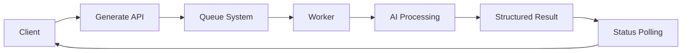
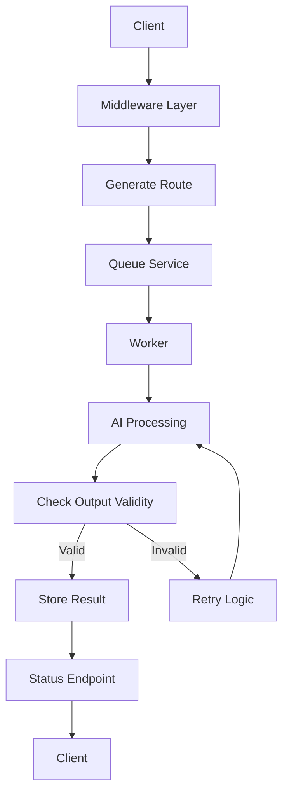
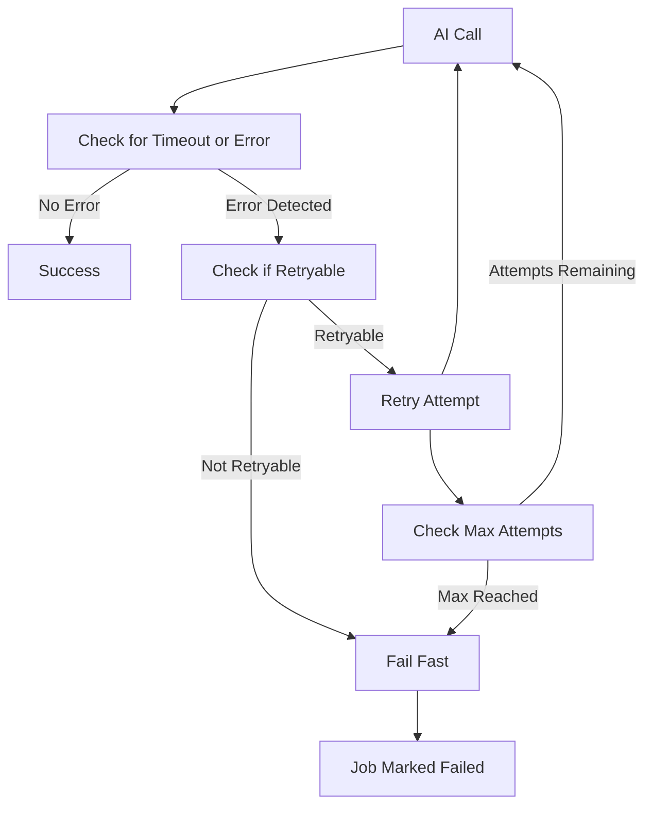

# AI Assisted Compliance Documentation System

This project is a backend system that transforms unstructured compliance or policy text into structured regulated checklists using AI.

It's designed for environments like fintech, healthtech, and regtech where AI output can't just "look right" it needs to be consistent, traceable, and more importantly reliable.

The focus is not just generating an output, but building a system that behaves predictably under real world conditions such as:

- asynchronous processing  
- external API failures  
- retries and timeouts  
- invalid AI responses  
- system observability and debugging  

Rather than treating AI as a trusted source, the system validates and enforces structure on every response to keep outputs consistent and usable.

---

## Key Features

- Asynchronous job processing with polling (non blocking API design)  
- Explicit job lifecycle management (processing -> completed -> failed)  
- Retry logic with failure classification (retryable vs non retryable errors)  
- Timeout handling and stuck job detection  
- AI output validation with enforced structure and guardrails  
- Structured logging across requests, jobs, and AI layers  
- Request tracing using request Id for end to end visibility  
- Basic monitoring for repeated failures and system anomalies  
- Rate limiting to prevent API abuse and protect system resources  
- Authorization middleware to secure internal endpoints  
- Input validation to prevent malicious or unsafe requests  
- Secure backend proxy (API keys never exposed to client)  

---

## Security

Security is treated as part of the system design, not something added later.

Regulatory environments handle sensitive information, which makes them a target for two specific threat patterns this system is designed to address, which are: information disclosure through fragmented data leakage, and prompt input attacks intended to expose or manipulate backend logic through the AI layer.

The business layer trusts requests passed down from the policy layer without reverification, which means upstream controls aren't optional. If something malicious is cleared within the policy layer, it is executed. That is why these controls exist at the entry point to ensure malicious attacks do not reach the AI layer:

- **Rate limiting** — per IP request limiting to prevent abuse and protect system resources  
- **Authorization middleware** — internal endpoints are restricted and not publicly exposed  
- **Secure API proxy** — AI provider keys are never exposed to the client; external calls go through the backend  
- **Input validation** — malicious or unsafe requests are rejected before reaching core processing logic  

This aligns with the access control and auditability expectations in compliance heavy environments.

---
## Architecture

## System Overview



## Detailed Request Flow



## Failure Handling Flow


### Request Flow
Client -> Request Tracking -> Rate Limiting -> Authorization -> Validation ->
Routes -> Queue -> Worker -> AI Processing -> Result -> Status Polling

### System Design

The system is structured with clear separation of concerns:

- **routes** — handle request/response flow  
- **middleware** — enforce control (validation, auth, rate limiting)  
- **services** — handle business logic and async processing  
- **queue** — manages job lifecycle and worker execution  

### Core Design Principles

- Non blocking async job lifecycle instead of synchronous processing  
- Isolation of AI logic from client facing layers  
- Controlled handling of unreliable external dependencies  
- Minimal shared/global state to avoid unpredictable behavior  
- Observability first design for debugging and monitoring  

---

## AI Processing & Guardrails

AI output is treated as unreliable by default.

The system enforces structure through:

- AI temperature setting to 0 (strengthens predictable output)
- predefined response schema
- validation of required sections  
- retry logic when output is invalid  
- failure classification to avoid unnecessary retries  

This ensures outputs are consistent and usable, rather than passing raw AI responses directly to the client.

---

## Observability & Reliability

The system is designed so behavior can be traced under failure conditions:

- request level tracing using requestId  
- job lifecycle logging (creation, attempts, success, failure)  
- AI request logging with duration tracking  
- failure monitoring for repeated system issues  

### Failure Scenarios Handled

- timeouts  
- retry exhaustion  
- invalid AI responses  
- stuck job detection  

---

## Testing

Testing focuses on real system behavior, not just isolated functions:

- endpoint testing using Jest and Supertest  
- async job lifecycle validation (processing -> completed)  
- failure simulation (queue failures, invalid responses)  
- time based testing to validate async transitions  
- isolation of dependencies using mocks  

---

## Why This Project?

When I began researching AI assisted systems, I noticed a pattern, most AI projects stop at "it works."

This project focuses on what happens when it doesn't:

- What happens when the AI fails?
- What happens when a job gets stuck?
- What happens under repeated failures?
- How does the system recover or degrade gracefully?

The goal was to build something closer to a real production system, not the API wrapper pattern common in most AI projects, but a controlled and observable processing pipeline designed for environments where failure is consequential.

Compliance is a real and growing problem in regulatory environments. The volume of documentation, policy review, and audit trails required in fintech, healthtech, and regtech creates significant operational overhead. AI can reduce that, cutting hours or weeks of manual documentation work down to a structured, reviewable output in seconds.

But AI is not always reliable. It can produce inconsistent responses, miss required structure, or hallucinate information, none of which is acceptable in a regulated environment. This system was built with that reality in mind.

The design is intentionally AI assisted, not AI automated. A person must remain the final authority on every policy output. The system handles generation, validation, and reliability, however, the reviewer handles judgment. That distinction is what makes this deployable in real compliance workflows, not just impressive in a demo.

This project sits at the intersection of AI capability and AI governance, demonstrating not just what AI can do, but how to build around what it can't be trusted to do alone. 

---

## Getting Started

### Prerequisites

- Node.js v18+
- OpenAI API key

### Installation
```bash
git clone https://github.com/JustinFontenelle/ai-compliance-internal-tool.git
cd ai-compliance-internal-tool
npm install
```

### Environment Variables

Create a `.env` file in the root directory:
```
OPENAI_API_KEY=your_key_here
AUTH_TOKEN=your_internal_auth_token
PORT=3000
```

| Variable | Description |
|---|---|
| `OPENAI_API_KEY` | Used by the backend to call the OpenAI API (never exposed to client) |
| `AUTH_TOKEN` | Internal API authentication for protected routes |
| `PORT` | Server port (default: 3000) |

### Run the Server
```bash
node server.js
```

Server will start on `http://localhost:3000`

### Run Tests
```bash
npm test
```

---

## API Reference

### Generate Checklist
`POST /generate`

Headers:
```
x-api-key: <AUTH_TOKEN>
```

Body:
```json
{
  "text": "Your compliance or policy text"
}
```

Response:
```json
{
  "jobId": "job-123"
}
```

### Check Job Status
`GET /status/:jobId`

Response:
```json
{
  "status": "processing | completed | failed",
  "progress": "...",
  "result": "...",
  "error": null
}
```

### Notes

- The system uses asynchronous processing — results are not returned immediately
- Clients must poll the `/status` endpoint to retrieve results
- AI responses are validated and may be retried before completion

---

## Tech Stack

- **Node.js** — runtime environment
- **Express.js** — API layer and routing
- **OpenAI API** — accessed via secure backend proxy
- **Custom in-memory job queue** — async job processing with lifecycle management *(Redis migration in progress)*
- **REST API** — polling-based async architecture
- **Middleware layer** — validation, authorization, rate limiting
- **Structured logging** — request tracing and observability
- **Jest / Supertest** — async lifecycle testing and failure simulation
- **Error handling** — failure classification and retry strategies

---

## Roadmap

- [x] Redis integration for persistent job state (replacing in-memory storage)
- [ ] Redis backed queue system (LPUSH / BRPOP for job processing)
- [ ] Worker decoupling and distributed job processing
- [ ] Queue persistence and recovery across restarts